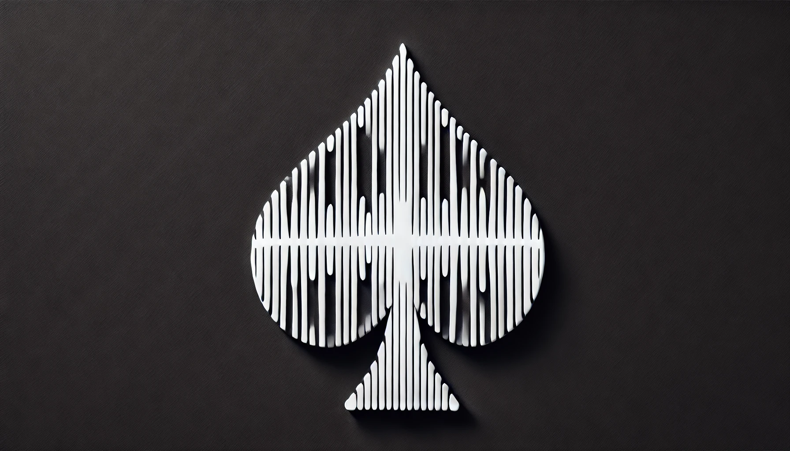

# Spade: the AI poker dealer for our poker nights

Real cards on a real table. Each player's phone reads their own hole cards, a table camera reads the board, bets are tapped in, and Spade runs the hand, calls the winner and keeps the books. How a night works and what Spade is (and isn't): [PRODUCT.md](PRODUCT.md).

**Status (October 2026):** being rebuilt. Version 0 sets up the working process. Version 1 rebuilds Spade around card detection: a simpler backend, a new web hub and a native iOS player app. Roadmap: [docs/handoffs/INDEX.md](docs/handoffs/INDEX.md).

| Part | What |
|---|---|
| [`spadeboot/`](spadeboot/) | Spring Boot backend |
| [`cv/`](cv/README.md) | card detection (Python, YOLOv8) |
| `client/`, `webapp/` | the 2025 React apps (frozen, being replaced) |

Run it: [USAGE.md](USAGE.md). Docs map: [docs/README.md](docs/README.md).

Built by Sebastian Rogg, with Luca Bozzetti and Markus on the 2024–25 versions ([lineage](docs/status-quo/lineage.md)).
