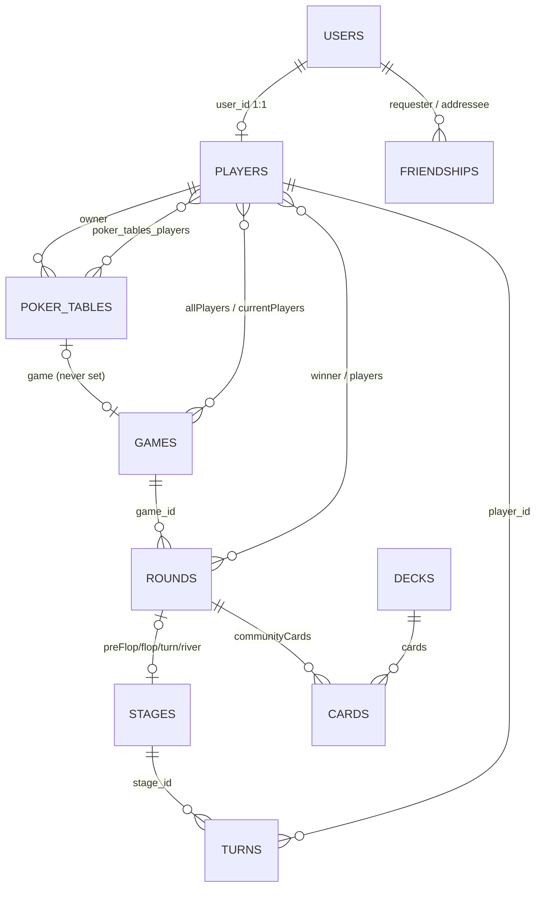

> **Raw audit, 2026-10-09.** Read-only subagent report, kept as evidence for [the V0 spec](../V0_2026-10-09_FOUNDATION.md). Not maintained: Phase 04 turns it into `docs/status-quo/`. Paths and line numbers were true on the audit date.

# SpadeBoot backend: status-quo audit

The backend is a working lobby (accounts, friends, poker tables) plus an in-memory Texas Hold'em engine with several game-breaking bugs. There is no AI, computer vision or text-to-speech code in this repo.

On `master`, the backend source has not changed since the import commit `27329b6` (2025-07-21). Later commits only touched Docker and ignore files. I modified nothing; tests wrote only to the ignored `target/` folder, and `git status` is identical before and after.

**Uncommitted changes you asked about:**
- **`pom.xml:159-163`** adds H2 as a runtime dependency. The context-load test needs this because the local `application.yml` points at an in-memory H2 database.
- **`ChipInventoryDto.java:13,24,36`** adds a 20-value chip (`chip20`). A matching 3-line change in the client's `ChipDistributionCard.js` adds the 20-chip to the UI. The hard-coded presets in `CheatsheetController.java:39-69` still lack `chip20`.
- **`CheatsheetService.java:226`** switches Gurobi from `new GRBEnv(true)` plus `env.start()` (cloud-license style) to `new GRBEnv()`, which reads a local `gurobi.lic`.
- `client/` and `webapp/` `cert.pem`/`key.pem` were regenerated (new self-signed cert for `spade-dev.local`, valid to Jan 2027), and `.DS_Store` changed.

---

## 1. Stack

| Area | What's there |
|---|---|
| Framework | Spring Boot **3.4.4** (`pom.xml:9`), Java **17** (`pom.xml:20`). The local JDK is 22 and builds fine. |
| Persistence | Spring Data JPA, `ddl-auto: update` (no migrations). **MySQL 8** in the docker profile, **H2 in-memory** in the base `application.yml:5-9`. QueryDSL is declared but unused. |
| Security | Spring Security plus jjwt 0.12.6. The `jjwt.version` property (0.12.5, `pom.xml:21`) is ignored because versions are hard-coded at `:73-85`. OAuth2 client and resource-server starters are on the classpath but unused. |
| Realtime | `spring-boot-starter-websocket` with a STOMP simple in-memory broker, plus `spring-security-messaging`. |
| Optimisation | **Gurobi 12.0.2** (commercial solver, needs a license and native libraries), used by the chip optimiser. |
| Third-party APIs | Spotify OAuth via `RestTemplate`; Genius lyrics via `GeniusLyricsAPI` from jitpack (`pom.xml:146,185`). |
| Unused dependencies | Thymeleaf (no templates), jsoup, org.json, Apache httpclient 4, BouncyCastle, `jakarta.annotation-api`, QueryDSL, both OAuth2 starters. Actuator is present with no configuration. |
| Build | Maven wrapper; `spring-boot-maven-plugin` only; no linting or coverage. |
| Dockerfile | Multi-stage build (Maven 3.9.9 / Temurin 17). It downloads **ARM64-only** Gurobi (`Dockerfile:20-33`), so the image only runs on ARM hosts. `EXPOSE 8080`. |
| docker-compose | Two services: `app` and `mysql:8.0`. MySQL port 3306 is published to the host (`docker-compose.yml:29`), and `~/gurobi.lic` is mounted read-only. **Likely broken:** `application-docker.yml:2-3` binds the app to `127.0.0.1:5467` inside the container, but compose maps `8080:8080`, so the app is unreachable from outside. |
| Profiles | `dev` is the default (`application.yml:3`): port 8080, SSL via `keystore.p12`. `docker` and `prod` use `127.0.0.1:5467` with SSL off, which implies a host reverse proxy for `hub.poker-spade.de`. |

**Secrets (values not printed):**
- **Real secrets exist locally in untracked, gitignored files:**
  - JWT secret: `application.yml:19`, `application-docker.yml:23`
  - Genius token: `application.yml:23`, `application-docker.yml:33`
  - Keystore password: `application-dev.yml:6`
  - Spotify client ID and secret: dev `:13-14`, docker `:27-28`, prod `:8-9`
  - Database passwords: `application-docker.yml:11,37-40`
  - `spadeboot/.env` (MySQL credentials)
  - `keystore.p12`
- **Already in git history:**
  - `spadeboot/gurobi.lic` was committed in `3f25aee` and deleted in `358da91`, so it is still in `master`'s history.
  - The remote branch `origin/add_first_game_logic` (an unrelated March-2025 history with no merge base) has commits that added `src/main/resources/application.yml` and `src/main/resources/app.key` (`8bb82e6` through `0d50468`, one named "Strong secret").
  - **Treat all of these as leaked and rotate them.**
- `src/main/resources/info` says the secrets live in the Discord channel, so a fresh clone cannot boot.

## 2. Packages (`com.spadeboot`, ~5,670 lines of main code in 84 files)

| Package | Contents |
|---|---|
| (root) | `SpadebootApplication`: entry point with an ASCII banner |
| `config` | Security, two separate CORS configs, WebSocket plus WebSocket security, role hierarchy, a scheduler (session cleanup every 5 min), `RestTemplate`, `ApplicationConfig` (registers static utility classes as beans for no reason), `DataInitializer` (seed users) |
| `security` | JWT utilities, JWT filter, 401 entry point, `UserDetails` implementation and service |
| `api.controller` | User, Player, Table, Game, Friend controllers |
| `api.controller.spadehub` | Cheatsheet, Spotify |
| `api.controller.archiv` | Invitation, Replay and Statistics controllers, **100% commented out** |
| `api.dto`, `api.dto.request(.user)`, `api.dto.response` | WebSocket/game DTOs mixed in with request/response DTOs |
| `domain.card` | `Card`, `Deck` (JPA entities), `Suit`, `Value`, `CardHelper` |
| `domain.game` | `PokerTable`, `Game`, `Round`, `Stage`, `Turn` (entities), `HandEvaluation`, plus enums |
| `domain.user` | `User`, `Player`, `Friendship`, plus enums |
| `repository` | Only 4 repositories: User, Player, Table, Friendship |
| `service`, `service.spadehub` | User, Table, Game, Friend; Cheatsheet, Spotify |
| `session` | **The poker engine:** `SessionManager` (in-memory map), `GameSession` and `RoundSession` (both `extends Thread`) |
| `websocket` | STOMP `@MessageMapping` handler, event publisher, connect/disconnect listener |
| `exception` | `GlobalExceptionHandler`, `NotFoundException`, `InvalidMoveException` |

## 3. Domain model

- **Only `users`, `players`, `poker_tables` (plus its join table) and `friendships` are ever written.** `Game`, `Round`, `Stage`, `Turn`, `Card` and `Deck` have no repository and are only used as in-memory objects. Their tables exist but stay empty.
- On H2, `cards` fails to create because `value` is a reserved word (seen in the test log).
- Seating state is stored twice: the join table and `Player.currentTableId`.
- Money is split between `User.balance` (the "bank") and `Player.chips` (stack at the table). `User.absInvestment` exists as well.

## 4. API surface

| Area | Endpoint | Notes |
|---|---|---|
| **Auth/Users** `/api/users` | `POST /register`, `POST /login` | Public. Login returns `{token, user}`. |
| | `GET /me`, `GET /{id}` | `/{id}` lets any logged-in user read anyone's email and balance. |
| | `PUT /me`, `PUT /me/password`, `PUT /me/avatar` (multipart) | Changing the username invalidates the JWT, whose subject is the username. |
| | `PUT /{id}/role`, `PUT /{id}/balance` | Admin only via `@PreAuthorize`. The security config matcher says `/roles` (`SecurityConfig.java:73`), a typo. |
| **Players** `/api/players` | `GET /me` | **Returns the full `User` entity, including the password hash** (`PlayerDto.java:12`, `PlayerController.java:84`). |
| | `GET /current-table` | |
| **Tables** `/api/tables` | `POST /`, `GET /`, `GET /public`, `GET /{id}`, `DELETE /{id}` | `GET /` also lists private tables. |
| | `POST /{id}/join?buyIn=`, `POST /{id}/leave` | |
| **Games** `/api/games` | `POST /tables/{id}/start?bigBlind=20`, `POST /tables/{id}/end` | Owner only. |
| | `GET /tables/{id}/status` | Any user can call it, and it **includes everyone's hole cards**. Errors come back as HTTP 200. |
| **Friends** `/api/friends` | `POST /requests`, `GET /requests/pending`, `GET /requests/sent`, `POST /requests/{id}/accept`, `POST /requests/{id}/decline`, `GET /`, `GET /{id}` (no ownership check), `DELETE /{username}`, `GET /check/{username}` | |
| **Cheatsheet** `/api/cheatsheet` (public) | `GET /heatmap` | Hard-coded 169-hand table. |
| | `POST /chips/optimize` | Runs up to 50 Gurobi solves per request. |
| | `GET /chips/presets` | Hard-coded. |
| | `POST /chips/save-preset` | **Fake:** saves nothing. |
| **Spotify** `/api/spotify` (public) | `GET /login`, `GET /callback`, `GET /refresh_token`, `GET /lyrics` | `/api/spotify/debug/**` is allowed in security config but has no handler. |
| **STOMP** | Endpoint `/ws` (SockJS and native) | Allowed origins are localhost:3000 only. |
| | Client sends to `/app/game/{tableId}/action`, `/connect`, `/disconnect` | |
| | Server sends to `/topic/tables/{tableId}` and `/user/queue/errors` | |

**The frontends call endpoints that don't exist:** `/api/games/tables/{id}/my-cards`, `/cards/scan`, `/history`, `/rounds/{id}/history`, `/ai-hint`, and `/api/players/{id}`.

**Error delivery over WebSocket is likely broken.** `GameWebSocketHandler.java:49` sends errors with the session ID used as the user name, and `@SendToUser` on a `void` method does nothing.

## 5. Feature inventory

| Feature | Status | Evidence |
|---|---|---|
| Register, login, JWT | Works | `UserService.java:44-84` |
| Profile, password, avatar | Works | |
| Admin role and balance top-up | Works | |
| Friends | Works | `FriendService` |
| Table lobby (create, join, leave, delete) | Partial | `hasActiveGame` is always false because `PokerTable.game` is never set, so a table can be deleted mid-game. |
| **Hold'em engine** | Partial | See below. |
| Game history, replays, statistics, invitations | Dead | Controllers commented out; game tables never written. |
| Win probability, AI hints | Stub | `Player.winProbability` is always 0.0; no hint endpoint. |
| **Card detection, CV, TTS, "AI dealer"** | Not in this repo | See below. |
| Cheatsheet heatmap | Works | Static data. |
| Chip optimiser | Partial | Needs a Gurobi license and ARM native libraries. On early exit, the Gurobi model and environment are never disposed (`CheatsheetService.java:267-272`). |
| Save chip preset | Stub | `CheatsheetController.java:74-82` |
| Spotify login and lyrics | Works if secrets are present | Genius scraping is fragile. |
| Seed data | Works, but dangerous | Creates an admin and 6 users with hard-coded passwords **in every profile**, and prints the passwords to stdout (`DataInitializer.java:40-66`). |

**Hold'em engine (`session/`), what it has:** blinds (including the heads-up rule), pre-flop/flop/turn/river betting loop, check/call/raise/fold/all-in, auto-fold after 600 seconds, dealer rotation, hand ranking, split pot. It is a raw thread per game plus one per round, coordinated with a `CountDownLatch`.

**Engine bugs:**
- **Flushes and straight flushes are never detected.** `HandEvaluation.java:139` compares the `Suit` enum to the strings `"S"`, `"H"` and so on, which never match.
- **No side pots.** A short all-in can win the whole pot, and integer division drops odd chips (`RoundSession.java:476-517`).
- **Chip results are never saved.** `Player` entities are detached and mutated on background threads with no `save()` anywhere in `session/`. `leaveTable` refunds the database value, which is the original buy-in, so winnings and losses vanish.
- **Every player's hole cards are broadcast** to everyone (`GameSession.java:317-318`, marked "for debugging").
- The action response is built before the round thread actually applies the action (`RoundSession.java:290-320`), so the pot and stack figures in it are stale.
- The "cards revealed", "winner" and "your turn" events are never published: `publishCommunityCards`, `publishWinner` and `publishPlayerTurn` are unused, and `stateChanged` is never set. Clients must poll `/status`.
- Minimum raise is the big blind rather than the last raise size.
- An exception inside the round thread silently kills the hand.

**Where the "AI dealer" lives:** nowhere in this backend. The README claims Python and PyTorch. The webapp's `CardScanner.js` sends `socket.emit("frame", …)` over a **socket.io** connection to `http://localhost:8080` (`webapp/src/App.js:13-22`), but Spring speaks STOMP, not socket.io. That implies a separate Python socket.io computer-vision service that isn't in this repo. No Python URLs or clients exist in `spadeboot/`.

## 6. Security

**Model:**
- Stateless HS256 JWT, valid for 24 hours, with the username as its subject.
- No refresh tokens, no revocation, no login rate limiting.
- BCrypt password hashing.
- Roles are plain strings with `ADMIN > USER` hierarchy.

**Issues:**
1. Seeded admin with a known weak password, in production too.
2. Password hash leaks through `GET /api/players/me`.
3. Hole cards leak through REST `/status` and through the WebSocket topic.
4. **WebSocket security is effectively off:**
   - A STOMP `CONNECT` without a valid token is still accepted (`WebSocketSecurityConfig.java:41-62`).
   - There is no authorisation on `SUBSCRIBE`, so anyone can watch any table.
5. Public `/api/cheatsheet/chips/optimize` lets anyone trigger up to 50 solver runs per request, a denial-of-service and license-cost risk.
6. **Spotify OAuth:**
   - The `state` parameter is never validated.
   - Tokens are returned in the redirect URL.
   - `refresh_token` is a public endpoint that uses the app's client secret.
7. Two duplicate CORS configs (`CorsConfig` and `SecurityConfig:103`) plus a third list of origins in `WebSocketConfig`. All are localhost-only; none lists the production domain.
8. The JWT filter keeps its own public-path list, duplicating `SecurityConfig`.
9. Raw exception messages are returned to clients (`GameController`, entry point).
10. `GET /api/friends/{id}` lets any user read any friendship by ID.

## 7. Tests

`./mvnw -q -o test` compiles and runs **10 tests: 5 pass and 5 fail.**
- `SpadebootApplicationTests.contextLoads` **passes**, but only because of the untracked local `application.yml` and the uncommitted H2 dependency. On a fresh clone it would fail on the missing `app.jwt.secret`.
- `GameServiceTest`: 4 of 9 pass. Three failures and two errors are all `NullPointerException` at `Player.getUserId()`, because the test fixtures never set `Player.user`. The tests are stale.
- There are no tests for `HandEvaluation` (which is how the flush bug went unnoticed), `RoundSession`, controllers, security or WebSocket.

## 8. Code quality

- **Largest classes (lines):** `RoundSession` 606, `GameSession` 435, `HandEvaluation` 323, `CheatsheetService` 295 (about 185 of which are hard-coded data), `FriendService` 241, `UserService` 188, `GameService` 173, `TableService` 166.
- **Concurrency:** game state is driven by raw subclassed threads, with `synchronized` and a `ReentrantLock` both guarding the same code. Shared entities are mutated without coordination, and `@Transactional` is applied to purely in-memory operations.
- **Duplication:**
  - Blind-position maths appears 3 times in `GameSession` (`:163-177`, `:284-298`, `:324-338`).
  - Action validation in `validateAction` repeats the checks in the `handleX` methods.
  - `GameAction` enum (unused) duplicates `PlayerActionDto.ActionType`.
- **Entity leaking into the API:**
  - `PlayerDto.user` exposes the `User` entity.
  - The service's inner class `HeatmapDataPoint` is used directly as the API type.
  - JPA entities double as game-engine objects.
- **Error handling is inconsistent:**
  - `IllegalArgumentException` (e.g. "Username already exists") has no handler, so it becomes a 500.
  - `GameController` builds ad-hoc maps and returns 200 on failure.
  - Responses mix plain maps and DTOs.
- **Other:**
  - 44 field `@Autowired` injections.
  - `@Transactional` imported from both `jakarta` (`TableService`, `UserService`) and Spring.
  - 28 `System.out` / `printStackTrace` calls.
  - 47 files carry stale `// src/main/java/com/pokerapp/...` header comments.
  - German and English comments are mixed.
- **N+1 queries:** `TableService.getAllTables` and `getPublicTables` (`:139-151`) call `findAll()` with EAGER loading of players → users → owner, and filter in memory. `Friendship`'s many-to-one relations default to EAGER.
- **TODOs:** 7 (`Player.java:79,84`; `CardHelper.java:19,39`; `HandEvaluation.java:289,290,308`), plus 5 "FIXED" comments in `session/` that look like leftover AI-patch markers.
- **Dead code:**
  - The `archiv/` controllers.
  - `HandEvaluation.findPrimarySuite` and `cardsToRankString`.
  - `RoundSession.getNextActivePlayer`, `SessionManager.getActiveTableIds`.
  - `Player.pay`, `rebuy`, `isAllIn`.
  - Three publisher methods, `WinnerDto`, `GameAction`, `Turn`.
  - Event types `ROUND_*`, `CARDS_DEALT`, `POT_DISTRIBUTED`.
  - `Poker_Chip_Tracker.xlsx` in resources, referenced by no code.

## 9. Git history and hygiene

- `master` has 17 commits from a single author, 2025-07-21 to 07-26.
  - The initial import was 531 files and 54,922 lines.
  - The "cleanup" commits removed 3,150 lines of UI template.
  - The two "vibe" commits touched only `client/`.
  - The last commits are Docker setup.
- The earlier multi-author history (Sebastian, JonasHoerter, Markus, March 2025) survives only in the orphan branch `origin/add_first_game_logic`.
- Commit messages are not descriptive.
- **Tracked files that shouldn't be:**
  - 7 `.DS_Store` files under `spadeboot/` (despite the gitignore).
  - `client/` and `webapp/` `cert.pem` and **`key.pem` (private keys)**.
  - `client/` and `webapp/` `.env.development` and `.env.production` (only API base URLs, low risk).
- `target/` is not tracked, which is good. The `.gitignore` also excludes the Docker and config files.

---

## Top 15 cleanup items, ranked by value

1. **Rotate every secret** (JWT, Spotify, Genius, database, keystore, Gurobi license). Then purge `gurobi.lic` from history and delete or scrub `origin/add_first_game_logic`.
2. **Stop the cheating leaks:** remove hole cards from `PlayerStateDto` and `/status`, and send each player only their own cards on a per-user queue.
3. **Remove the seeded admin and default passwords** from non-dev profiles, and stop printing passwords.
4. **Fix the password-hash leak:** `PlayerDto` should not embed the `User` entity. Audit every DTO for the same problem.
5. **Fix the flush and straight-flush detection bug** (`HandEvaluation.java:139`) and add a table-driven hand-evaluator test suite.
6. **Persist game results:** write chip changes back to the database (and hand history if you want stats), or explicitly decide that only buy-in and cash-out matter.
7. **Implement side pots** and odd-chip handling.
8. **Require a valid JWT on STOMP `CONNECT`** and authorise `SUBSCRIBE` to table topics (seated players only).
9. **Replace the thread-per-game engine** with a single-threaded, event-driven state machine (pure domain plus a per-table actor or executor), and publish all state transitions.
10. **Fix Docker:** port and bind mismatch, ARM-only Gurobi, the MySQL port exposed to the host. Introduce Flyway/Liquibase instead of `ddl-auto: update`.
11. **Ship a committed, secret-free config:** `application.yml` with environment-variable placeholders plus an example `.env`, so a fresh clone boots and CI can run.
12. **Remove dead code and dependencies:** `archiv/`, unused entities and events, Thymeleaf, QueryDSL, jsoup, org.json, httpclient, BouncyCastle, both OAuth2 starters.
13. **Standardise errors and API shape:** one error format (e.g. Problem Details), map `IllegalArgumentException`, no 200-on-error. Consolidate CORS into one config, use constructor injection, use SLF4J instead of `System.out`.
14. **Decide Gurobi's fate.** A small integer program like this can likely use a free solver or a simple greedy/DP. At minimum, require auth and dispose resources.
15. **Fix tests and add CI:** repair the fixtures, add controller and security slice tests, run H2 or Testcontainers in CI. Also untrack `.DS_Store` and the PEM files.

## Open questions for you

1. Where is the Python CV/TTS service (the socket.io server receiving `frame`)? Should it be part of the rebuild, and should the backend or the frontend talk to it?
2. Is the product a **physical-table assistant** (real cards, camera detection, dealer announcements) or an **online poker client**? The engine assumes online, the README says physical.
3. How does production actually run on `hub.poker-spade.de` (reverse proxy, which host architecture)? The compose file as written can't serve traffic.
4. Should chips and balance carry real persistent value (profit tracking, per the TODO at `Player.java:79`), and do you need hand history, replays and statistics?
5. Keep the Spotify/lyrics "SpadeHub" and the cheatsheet features in the backend, or drop or split them out?
6. Which frontend is canonical: `client/` or `webapp/`? Both call the same nonexistent endpoints.
7. Can the orphan branch `add_first_game_logic` be deleted, and is a history rewrite acceptable to remove the leaked files?
8. Keep MySQL, or switch to Postgres while rebuilding anyway?