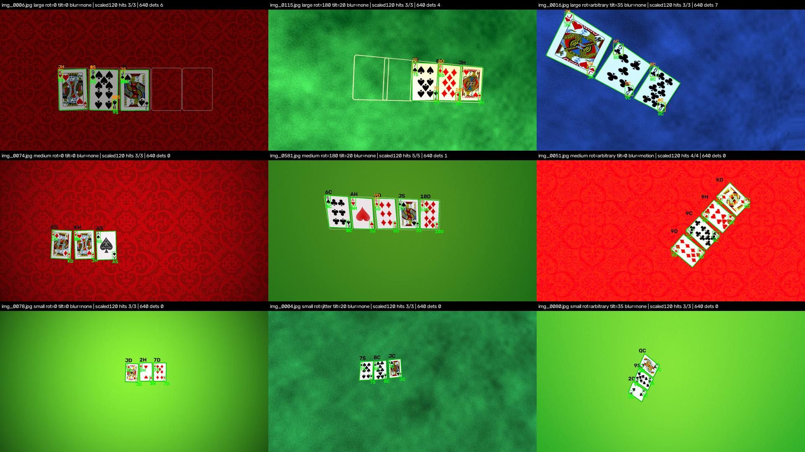

# CV proxy spike: the model on synthetic overhead boards

> **Evidence, 2026-10-09. THROWAWAY, and NOT a substitute for the real spike ([#3](https://github.com/eixfachZabii/Spade/issues/3)).**
> Item 1 for the V1 grill ([INDEX](../INDEX.md)) is blocked: the owner has no cards or mat right now. This stand-in renders the legacy 52-card PNG deck onto synthetic felt and runs the production model over it. It is an early signal about the *pipeline* (scale, crops, orientation, blur), not about the real camera, the real deck or the real light. #3 stays open.
> A subagent (Sonnet) generated the images and ran the measurements in a throwaway worktree (`spike/v1-throwaway`, never merged); the coordinator wrote this doc from its report.

## The short version
- **Scale is the first lever, not the model.**
  - The model reads cards well when a card is about **65–190 px wide in the model's input** (best about 100–140 px).
  - The production call (`model(img)`, imgsz 640) on a 1920×1080 overhead frame shrinks the cards below that: **16% of cards read**.
  - Resizing so each card lands at about 120 px in the input lifts that to **62% overall and 90% on sharp frames**.
- **Reading per slot, scaled, with one answer per slot** (top confidence) gives the best whole-board rate: **59% of sharp boards exactly right** (vs 18% reading the whole frame).
  - A wrong label from a card's other corner then no longer spoils the board.
  - A plain slot crop *without* scale control is worse (22–29%), because ultralytics upscales it past the model's range.
- **Upside-down cards are not a problem:** cards turned 180°, singly or as a whole board, read within 1–2 points of upright ones.
- **Blur is the biggest enemy:** sharp 90% → Gaussian blur 46% → motion blur 21%. Tilt (up to 35°), noise, white balance, glare and background colour move the result only a few points.
- **Wrong rank, not wrong suit:** Q→9, K→J, A→4, 8→10 dominate; a suit swap is 40× rarer and stays the same colour.
- **The model never hallucinated a card on empty felt** (0 off-card labels in 1,040 frames), but that is the result most likely to change with real hands, chips and drinks on the table.
- **The deck design matters:** the 12 alternate face cards (same corners, different centre art) read about half as well. The model uses more than the corner index, so **#3 must test our actual deck**.

## Sources and setup
- **Model:** `cv/models/best_60_23.pt` (YOLOv8s, 52 classes, trained with ultralytics 8.3.78 on photos of real cards; training data not local).
- **Environment:** the locked `cv/` env, ultralytics 8.4.174, torch 2.14.1 (MPS), opencv-python 5.0.0.93, numpy 2.5.3, Pillow 12.3.0, Python 3.12. Apple M1, macOS 27.0.1.
- **Deck:** `client/src/assets/images/poker/card_deck/`:
  - 52 standard faces (500×726 RGBA, Inkscape exports at 215.44 dpi);
  - plus 12 alternate face cards (`*A.png`) and `ace_of_spades2.png` for a side run.
  - The deck's origin is still unverified; the agent could not confirm it as Byron Knoll's set.
- **Images** (seeded and deterministic; every parameter recorded per image in a manifest):

| Set | Frames | Card appearances | Seed |
|---|---|---|---|
| `main` (52 standard faces) | 1,040 | 4,159 (79–80 per card) | 20261009 |
| `alt` (12 `*A` faces + `ace_of_spades2`) | 156 | 624 (48 each) | 20261010 |

- **Frames:**
  - 1920×1080, JPEG q85, flop / turn / river (3–5 cards) in a five-slot row;
  - nominal card widths 90 / 140 / 200 px;
  - 12% of boards with 5–12% overlap.
- **Factors, balanced:**
  - board rotation 0°, ±8°, 180°, arbitrary; 20% of cards individually flipped 180°;
  - camera tilt 0° / 20° / 35° (a rotation homography);
  - blur none / Gaussian σ 1–2.5 / motion 5–15 px;
  - noise; an extra q35 JPEG pass;
  - dim / normal / bright; warm / neutral / cool; vignette, soft shadow, glare on one card;
  - green / blue / red felt, the legacy red pattern, a table render;
  - printed slot outlines on ⅓ of frames.
- **Scoring:**
  - A card is **hit** when a detection with its true label has its centre on the card.
  - For crop approaches, the slot's top-confidence box (centre inside the slot) must be right.
  - **Board exact:** every card hit and no off-card label (for crops: every slot's top-1 right).
- **Scripts:** `gen.py`, `run_models.py`, `run_all.sh`, `run_scaled.sh`, `sweep.py`, `analyze.py`, `montage.py`, on the local branch `spike/v1-throwaway` (not pushed, not merged). Raw outputs stayed in the session's scratch space.

### Approaches
| Name | What | Needs |
|---|---|---|
| `640` | the production call, `model(img)`, default imgsz 640 | nothing |
| `1280` | the same, `imgsz=1280` | nothing |
| `crop640` | crop each slot (card box + 25% margin), default imgsz (ultralytics upscales the crop) | known slot positions (a mat) |
| `scaled120` | full frame, imgsz chosen so a card is ~120 px wide in the model input | a fixed camera at a known height |
| `cropscaled120` | each slot crop resized so the card is ~120 px wide, tight imgsz | a mat and a fixed camera |

## Results
### Headline (`main`: 4,159 cards, 1,040 boards)
| Approach | Card hit % | Board exact % |
|---|---|---|
| 640 (production) | 16.4 | 0.8 |
| 1280 | 49.8 | 6.6 |
| crop640 (slot-filtered) | 29.2 | 8.8 |
| scaled90 / **scaled120** / scaled160 | 57.0 / **61.8** / 61.7 | 6.4 / **11.4** / 14.3 |
| cropscaled90 / **cropscaled120** / cropscaled160 | 56.2 / **57.7** / 58.2 | 30.2 / **35.9** / 39.1 |

**Sharp frames only** (blur = none: 520 boards, 2,070 cards):

| Approach | Card hit % | Board exact % |
|---|---|---|
| 640 (production) | 21.0 | 1.0 |
| 1280 | 68.2 | 8.1 |
| **scaled120** | **90.3** | 17.9 |
| **cropscaled120** | 85.8 | **58.5** |
| cropscaled160 | — | 63.3 |

### Scale sweep (clean, upright, flat, felt; 54 cards per cell; hit %)
| Card width in frame | …in a 640 input | imgsz 640 | imgsz 1280 | imgsz 1920 | crop640 |
|---|---|---|---|---|---|
| 60 px | 20 px | 0 | 0 | 44 | 4 |
| 90 px | 30 px | 2 | 33 | 89 | 30 |
| 140 px | 47 px | 2 | 81 | 93 | 63 |
| 200 px | 67 px | 69 | 93 | 89 | 61 |
| 280 px | 93 px | 85 | 89 | 76 | 56 |
| 340 px | 113 px | 89 | 85 | 54 | 56 |

The model's working range is a card about 65–190 px wide *in its input*; it falls off on both sides. A single full-resolution card (726×500) filling the frame was missed 28 of 32 times. That matters for the **phone path** too: hole cards held close to an iPhone camera can be *too big*, and the app should scale or crop to the model's range. The coordinator's Core ML parity check ([ios-stack §3a](ios-stack.md#3a-measured-on-this-mac-coordinator-2026-10-09)) used cards at ~85 px in the input and read 84% of them, consistent with this.

### Per layout and per factor (card hit %)
| Factor | 640 | 1280 | scaled120 | cropscaled120 |
|---|---|---|---|---|
| flop / turn / river | 16.1 / 18.5 / 14.8 | 49.8 / 52.2 / 48.0 | 62.9 / 63.1 / 60.1 | 59.3 / 58.5 / 56.0 |
| card size small / medium / large | 0.1 / 1.6 / 47.4 | 16.8 / 56.5 / 75.8 | 48.7 / 61.0 / 75.5 | 46.5 / 54.5 / 71.9 |
| board rotation 0° / ±8° / 180° / arbitrary | 17.9 / 16.3 / 17.3 / 14.0 | 50.8 / 49.3 / 52.3 / 47.0 | 60.8 / 59.3 / 63.2 / 63.8 | 55.7 / 56.0 / 59.1 / 59.7 |
| card upright / upside-down / sideways | 17.4 / 16.4 / 13.7 | 50.7 / 50.6 / 46.2 | 60.5 / 62.5 / 64.0 | 56.5 / 58.5 / 59.1 |
| card flipped alone: yes / no | 19.3 / 15.7 | 51.1 / 49.5 | 62.9 / 61.5 | 58.3 / 57.5 |
| tilt 0° / 20° / 35° | 19.2 / 16.2 / 12.7 | 50.4 / 52.7 / 46.3 | 61.9 / 63.2 / 60.2 | 58.0 / 58.6 / 56.2 |
| **blur none / Gaussian / motion** | 21.0 / 14.4 / 9.2 | 68.2 / 43.2 / 20.2 | **90.3 / 46.1 / 21.2** | **85.8 / 40.9 / 18.7** |
| brightness dim / normal / bright | 12.5 / 16.8 / 19.1 | 46.3 / 50.0 / 52.9 | 56.8 / 61.7 / 67.0 | 54.3 / 57.2 / 62.4 |
| white balance cool / neutral / warm | 16.1 / 17.0 / 15.4 | 50.5 / 50.8 / 47.3 | 65.8 / 60.3 / 60.8 | 61.1 / 56.3 / 57.0 |
| shadow no / yes | 17.6 / 12.7 | 51.2 / 45.8 | 62.9 / 58.5 | 58.7 / 54.4 |
| glare on that card no / yes | 16.6 / 12.5 | 49.8 / 50.5 | 61.9 / 59.6 | 57.6 / 59.6 |
| slot outlines no / yes | 14.8 / 19.5 | 49.5 / 50.4 | 61.2 / 63.1 | 56.7 / 59.6 |
| **cards overlap no / yes** | 17.2 / 10.2 | 51.5 / 37.8 | **64.3 / 43.4** | **61.0 / 33.5** |
| background green / blue / red / pattern / render | 16.5 / 16.9 / 15.8 / 14.4 / 18.2 | 50.5 / 49.7 / 50.3 / 50.1 / 48.4 | 64.3 / 60.4 / 61.4 / 62.0 / 59.1 | 58.1 / 56.5 / 59.3 / 59.2 / 55.1 |

**Size × blur** (card hit %, scaled120): small 91.8 / 7.3 / 3.6; medium 91.0 / 55.6 / 14.9; large 88.2 / 83.0 / 43.1 (none / Gaussian / motion). The blur was applied in full-resolution pixels, so it hits small cards hardest: σ = 2 px wipes out the corner index of a 90 px card.

### Per card (hit %, worst first by the production call; 80 appearances each, 8S 79)
| Card | 640 | 1280 | crop640 | scaled120 | cropscaled120 | Most frequent wrong label (scaled120) |
|---|---|---|---|---|---|---|
| AH | 2.5 | 21.2 | 1.2 | 56.2 | 38.8 | 4H ×8, 3H ×4 |
| KH | 3.8 | 40.0 | 45.0 | 55.0 | 53.8 | JH ×4, 7H ×3 |
| JC | 5.0 | 36.2 | 35.0 | 47.5 | 48.8 | QC ×2 |
| 3H | 6.2 | 45.0 | 48.8 | 61.2 | 61.2 | 5H ×7, 7H ×5 |
| 6C | 6.2 | 52.5 | 21.2 | 62.5 | 60.0 | 9C ×3, 8C ×2 |
| 6S | 7.5 | 38.8 | 23.8 | 58.8 | 52.5 | 9S ×5, 10S ×3 |
| 3S | 8.8 | 27.5 | 30.0 | 48.8 | 37.5 | 8S ×8, 5S ×5 |
| 5S | 8.8 | 52.5 | 40.0 | 58.8 | 50.0 | 10S ×3, 9S ×3 |
| KS | 8.8 | 35.0 | 28.8 | 57.5 | 53.8 | JS ×8 |
| AD | 10.0 | 37.5 | 0.0 | 58.8 | 58.8 | 4D ×8 |
| QH | 10.0 | 18.8 | 18.8 | 22.5 | 12.5 | 9H ×26 |
| KD | 11.2 | 43.8 | 20.0 | 63.8 | 60.0 | 7D ×2, JD ×2 |
| 10S | 12.5 | 53.8 | 16.2 | 57.5 | 55.0 | 9S ×3 |
| 5H | 12.5 | 57.5 | 53.8 | 77.5 | 75.0 | 9H ×4, 6H ×2 |
| 8C | 12.5 | 42.5 | 31.2 | 55.0 | 52.5 | 10C ×6 |
| KC | 12.5 | 30.0 | 20.0 | 38.8 | 40.0 | JC ×10 |
| 2C | 13.8 | 61.2 | 26.2 | 73.8 | 67.5 | 3C ×2 |
| 2H | 13.8 | 52.5 | 33.8 | 75.0 | 72.5 | 4H ×2 |
| 2S | 13.8 | 52.5 | 25.0 | 63.8 | 61.2 | — |
| 6D | 13.8 | 56.2 | 35.0 | 66.2 | 66.2 | 10D ×7, 8D ×3 |
| AC | 13.8 | 28.8 | 2.5 | 28.8 | 33.8 | 4C ×11, 3C ×8 |
| JH | 13.8 | 50.0 | 55.0 | 68.8 | 67.5 | — |
| JS | 13.8 | 48.8 | 41.2 | 63.8 | 62.5 | — |
| QS | 13.8 | 43.8 | 6.2 | 51.2 | 32.5 | 9S ×5, 8S ×3 |
| 10C | 15.0 | 48.8 | 5.0 | 58.8 | 52.5 | — |
| 2D | 15.0 | 48.8 | 20.0 | 77.5 | 77.5 | 4D ×2 |
| JD | 15.0 | 52.5 | 51.2 | 70.0 | 68.8 | — |
| 3D | 16.2 | 33.8 | 33.8 | 57.5 | 63.8 | 5D ×7, 10D ×4 |
| 4H | 16.2 | 53.8 | 28.8 | 67.5 | 61.2 | 6H ×2, 7H ×2 |
| 8D | 16.2 | 52.5 | 46.2 | 61.2 | 66.2 | 10D ×7 |
| 9C | 16.2 | 50.0 | 18.8 | 60.0 | 57.5 | — |
| AS | 16.2 | 47.5 | 2.5 | 68.8 | 65.0 | 4S ×3 |
| QC | 16.2 | 32.5 | 11.2 | 30.0 | 20.0 | 9C ×6, 6C ×5 |
| QD | 16.2 | 28.8 | 2.5 | 32.5 | 12.5 | 9D ×15, 8D ×9 |
| 3C | 17.5 | 47.5 | 45.0 | 63.8 | 33.8 | 5C ×10 |
| 6H | 17.5 | 57.5 | 52.5 | 67.5 | 70.0 | 10H ×9 |
| 7C | 18.8 | 58.8 | 21.2 | 68.8 | 66.2 | — |
| 5C | 20.0 | 51.2 | 32.5 | 56.2 | 55.0 | 9C ×2, 6C ×2 |
| 4S | 21.2 | 65.0 | 26.2 | 72.5 | 70.0 | 7S ×3, 6S ×2 |
| 8S | 21.5 | 59.5 | 26.6 | 68.4 | 67.1 | 10S ×4 |
| 10D | 22.5 | 63.8 | 18.8 | 80.0 | 73.8 | 9D ×1 |
| 5D | 22.5 | 58.8 | 47.5 | 70.0 | 70.0 | 10D ×5, 9D ×2 |
| 8H | 22.5 | 61.2 | 63.8 | 70.0 | 67.5 | 10H ×18 |
| 9D | 23.8 | 67.5 | 38.8 | 70.0 | 68.8 | 10D ×5 |
| 9H | 23.8 | 65.0 | 56.2 | 66.2 | 58.8 | 10H ×7 |
| 4D | 25.0 | 70.0 | 31.2 | 72.5 | 68.8 | 7D ×4 |
| 9S | 26.2 | 55.0 | 33.8 | 60.0 | 57.5 | 10S ×2 |
| 7S | 27.5 | 61.2 | 23.8 | 67.5 | 61.2 | 9S ×1, 10S ×1 |
| 10H | 31.2 | 62.5 | 25.0 | 77.5 | 78.8 | 9H ×1, 8H ×1 |
| 7D | 32.5 | 77.5 | 15.0 | 80.0 | 76.2 | 10D ×1 |
| 4C | 33.8 | 63.8 | 32.5 | 66.2 | 58.8 | 7C ×2, 9C ×1 |
| 7H | 36.2 | 71.2 | 50.0 | 81.2 | 77.5 | 10H ×3 |

- Most misses are "nothing detected", not misreads (QH 36, KC 39, JC 39 of 80 under scaled120).
- **Queens, aces and kings are the weak ranks.** QH, QD, QC and AC stay at or below about 33% even at the best scale. QH→9H (26×) and QD→9D (15×) are the largest single confusions.

### Failure modes (`main`, cards out of 4,159)
| Failure | 640 | 1280 | scaled120 |
|---|---|---|---|
| missed (no detection on the card) | 2,973 (71.5%) | 1,386 (33.3%) | 1,168 (28.1%) |
| wrong rank, suit right | 486 | 667 | 399 |
| wrong suit, rank right | 6 | 7 | 3 |
| wrong rank and suit | 13 | 26 | 19 |
| hit, but the other corner also gives a wrong label | 269 | 682 | 815 |
| off-card hallucination | 0 | 0 | 0 |

- **Rank confusions:** Q→9, K→J, A→4, 3→5/7, 8→10, 6→9/10, 4→7. The 6↔9 swap is a resolution effect, not an orientation effect: 31 at 640, 11 at scaled120.
- **Suit swaps** keep the colour (all 6 at 640).
- **Corners:**
  - A correct card is usually found by **both** printed corners at a good scale: 74% at scaled120, 37% at 640.
  - Production's `get_n_cards` keeps unique labels in detection order, so a second, wrong corner label gets into the read. That is why whole-frame exactness stays low even when card hits are high.
- **Confidence separates right from wrong** (cropscaled120, top-1 per slot):

| Top-1 confidence | Picks | Correct |
|---|---|---|
| 0.25–0.40 | 166 | 40.4% |
| 0.40–0.55 | 225 | 51.1% |
| 0.55–0.70 | 491 | 63.5% |
| 0.70–0.85 | 2,067 | 91.4% |

### The alternate face designs (`alt`, 624 cards)
- **Whole set:**

| Approach | Card hit % | Board exact % |
|---|---|---|
| 640 | 2.2 | 0.0 |
| 1280 | 21.0 | 0.6 |
| crop640 | 11.5 | 0.0 |
| scaled120 | 26.8 | 2.6 |
| cropscaled120 | 30.0 | 5.8 |

- **Sharp frames:** 45–54% at the best scale, against ~90% for the standard faces.
- **Worst cards:** QH and QS read 0% everywhere; QC 2.1%.
- **Read:** the same corner indices with different centre art halve the hit rate.

### Latency (warm, per frame, frame already decoded; JPEG decode adds ~5 ms)
| Approach | CPU median (p95) | MPS median (p95) | First call, fresh process |
|---|---|---|---|
| 640 | 71.5 (79.7) ms | 24.1 (25.4) ms | ~1 s |
| 1280 | 266.9 (315.9) ms | 67.4 (70.3) ms | 1.2–1.5 s |
| crop640, per board (~4 crops, one batch) | 580.6 (704.3) ms | 122.8 (158.3) ms | ~1–1.6 s |
| scaled120 (imgsz ~1,500–2,100) | 438.7 (1,042.8) ms ¹ | 107.6 (239.1) ms | ~1 s |
| **cropscaled120, per board** | 106.8 (133.4) ms ¹ | **35.3 (48.9) ms** | ~1 s |

¹ CPU scaled rows cover the first 150 frames only.
- CPU and MPS gave identical labels on every frame.
- A cold start took ~4 s for the first call.
- **Every approach is far below the time a dealer takes to turn a card.**

## Recommendation for the real spike (#3), as hypotheses
1. **Control the scale first.**
   - Measure how many pixels wide a card (and its corner index) is in the real overhead frame.
   - Try a board region of interest scaled to ~120 px per card before anything else.
   - The production 640 call on a full 1080p frame is the wrong default for an overhead camera.
2. **Read per slot, with one answer per slot.**
   - A printed mat with card slots (the legacy `camera.py` already finds the mat) turns the board into fixed crops.
   - Scale each crop and take the top-confidence label.
   - That beat whole-frame reading 3× on exact boards here.
3. **Gate on confidence:** below ~0.7, show "check the board" and ask for a correction instead of guessing. Above it, the proxy read was right 91% of the time.
4. **Buy sharpness:** a fixed-focus or focus-locked camera with a fast shutter, and only read when the frame is still (the board is static once dealt). Light colour barely mattered; blur dominated.
5. **Don't worry about orientation:** cards facing either half of the table read the same.
6. **Test our deck, and keep retraining as an option.** Deck art changed the result by 2×. If the real deck reads poorly, a small fine-tune on photos of it is the likely fix (the training repo is `lucabzt/SpadeClassifier`).
7. **The phone path has a scale question too:** cards held close may be *above* the model's range, so the app should crop and scale to it.

**Alternatives** if the real spike disappoints:
- **Manual board entry as the default**, with the camera as a suggestion the dealer confirms; the grill plans manual entry first anyway.
- **Each player's phone reads the board**: one more scan, no table camera. That puts more steps on the players.

## Not proven
- **Not the real camera:** no sensor noise, rolling shutter, autofocus hunting, lens distortion or demosaicing.
- **Not the real deck:** a vector deck with clean edges and flat white. The model was trained on photos of real cards, and §alternates shows deck art matters 2×.
- **Not the real light:** glare is a Gaussian spot, shadows and white balance are multipliers; no plastic sheen.
- **Not the real table:** no sleeves, bends, worn corners, chips, hands, drinks or phones over cards. The zero-hallucination result is the most fragile one.
- **Not real dealing:** neat rows in fixed slots; tilt is a pure homography without depth.
- **Blur strengths** are full-resolution pixel values, not tied to physical motion, so they likely punish small cards harder than a real camera at the same sharpness would.
- **The hole-card path** (an iPhone camera at hand distance) was not simulated beyond the one finding that very large cards also read poorly.
- **The images and raw results are not kept** (session scratch space); the scripts are on the local `spike/v1-throwaway` branch, so the run can be reproduced from the seeds.
