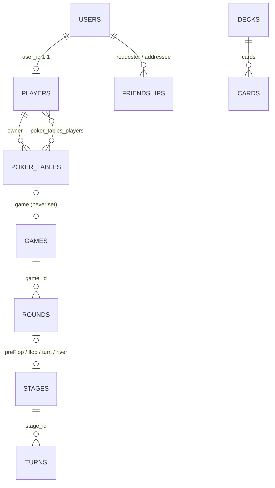

# Backend (`spadeboot/`): status quo, 2026-10-09

> Dated snapshot, not maintained (V0 spec §5). It describes the backend as V0 found it.
> **Changed since:**
> - Phase 01: secrets moved to env (`spadeboot/.env`, template `.env.example`); `JwtUtils` fails fast without a 32-byte secret; seed users only in the `dev` profile, with a password from env; the `info` file is gone.
> - Phase 03: flush, straight flush and full house fixed and pinned by `HandEvaluationTest`; `GameServiceTest` repaired. `./mvnw verify` is green.
>
> Evidence: [audit](../handoffs/V0_audits/audit-backend.md). Salvage verdicts: [salvage.md](salvage.md).

## Stack
- Spring Boot 3.4.4, Java 17, Maven wrapper (`spadeboot/pom.xml`).
- Spring Data JPA with `ddl-auto: update` (no migrations). H2 in memory by default; MySQL 8 in the `docker` profile.
- Spring Security + jjwt (HS256, username as subject, 24 h, no refresh). BCrypt passwords.
- WebSocket with a STOMP simple broker (`/ws`, prefixes `/app`, `/topic`, `/queue`).
- Gurobi 12 (commercial solver) for the chip optimiser; Spotify OAuth via `RestTemplate`; Genius lyrics via the `GLA` scraper.
- Declared but unused: QueryDSL, Thymeleaf, jsoup, org.json, httpclient 4, BouncyCastle, both OAuth2 starters, Actuator without config.
- Dockerfile builds an **ARM64-only** Gurobi image; compose binds the app to `127.0.0.1:5467` but maps `8080:8080`, so the container cannot be reached.

## Package map (`spadeboot/src/main/java/com/spadeboot/`)
| Package | Contents |
|---|---|
| `config` | Security, two CORS configs, WebSocket + WebSocket security, role hierarchy, scheduler, `RestTemplate`, `DataInitializer` |
| `security` | `JwtUtils`, JWT filter, entry point, `UserDetails` implementation |
| `api.controller` | User, Player, Table, Game, Friend; `spadehub/` Cheatsheet, Spotify; `archiv/` Invitation, Replay, Statistics (**fully commented out**) |
| `api.dto` (+ `request`, `request.user`, `response`) | game/WebSocket DTOs mixed with request/response DTOs |
| `domain.card` | `Card`, `Deck` (entities), `Suit`, `Value`, `CardHelper` |
| `domain.game` | `PokerTable`, `Game`, `Round`, `Stage`, `Turn` (entities), `HandEvaluation` |
| `domain.user` | `User`, `Player`, `Friendship` |
| `repository` | User, Player, Table, Friendship only |
| `service` (+ `spadehub`) | User, Table, Game, Friend; Cheatsheet, Spotify |
| `session` | **the Hold'em engine**: `SessionManager`, `GameSession`, `RoundSession` (both `extends Thread`) |
| `websocket` | STOMP handler, `GameEventPublisher`, connect/disconnect listener |
| `exception` | `GlobalExceptionHandler`, `NotFoundException`, `InvalidMoveException` |

## Domain model

- Only `users`, `players`, `poker_tables` (+ join table) and `friendships` are ever written. `Game`, `Round`, `Stage`, `Turn`, `Card`, `Deck` are `@Entity` classes used purely in memory; their tables stay empty.
- Seating is stored twice (join table and `Player.currentTableId`). Money is split between `User.balance` (bankroll) and `Player.chips` (stack).

## API surface (derived from the controllers at HEAD)
| Area | Endpoints |
|---|---|
| `/api/users` | `POST /register`, `POST /login` (public) · `GET /me`, `GET /{id}` · `PUT /me`, `PUT /me/password`, `PUT /me/avatar` · `PUT /{id}/role`, `PUT /{id}/balance` (admin) |
| `/api/players` | `GET /me`, `GET /current-table` |
| `/api/tables` | `POST /`, `GET /`, `GET /public`, `GET /{id}`, `DELETE /{id}`, `POST /{id}/join?buyIn=`, `POST /{id}/leave` |
| `/api/games` | `POST /tables/{tableId}/start?bigBlind=`, `POST /tables/{tableId}/end`, `GET /tables/{tableId}/status` |
| `/api/friends` | `POST /requests`, `GET /requests/pending`, `GET /requests/sent`, `POST /requests/{id}/accept`, `POST /requests/{id}/decline`, `GET /`, `GET /{id}`, `DELETE /{username}`, `GET /check/{username}` |
| `/api/cheatsheet` (public) | `GET /heatmap`, `POST /chips/optimize`, `GET /chips/presets`, `POST /chips/save-preset` (saves nothing) |
| `/api/spotify` (public) | `GET /login`, `GET /callback`, `GET /refresh_token`, `GET /lyrics` |
| STOMP | client → `/app/game/{tableId}/action`, `/connect`, `/disconnect`; server → `/topic/tables/{tableId}`, `/user/queue/errors` |

Re-derive with: `grep -rn "@\(Get\|Post\|Put\|Delete\)Mapping\|@RequestMapping\|@MessageMapping" spadeboot/src/main/java`.

## Feature status
| Feature | Status | Note |
|---|---|---|
| Register, login, JWT, profile, password, avatar | ✅ | a username change invalidates the token (subject = username) |
| Admin role and balance top-up | ✅ | |
| Friends | ✅ | no UI uses it |
| Table lobby (create, join, leave, delete) | 🟡 | `PokerTable.game` is never set, so a table can be deleted mid-game |
| Hold'em engine | 🟡 | see the defects below |
| History, replays, statistics, invitations | ❌ | controllers commented out; game tables never written |
| Win probability, AI hints | ❌ | `Player.winProbability` is always 0 |
| Card detection, TTS, "AI dealer" | ❌ | not in this backend at all (see [cv.md](cv.md)) |
| Cheatsheet heatmap | ✅ | static data |
| Chip optimiser | 🟡 | needs a Gurobi licence and native libraries; up to 50 solves per request |
| Spotify login and lyrics | ✅ | if credentials are set |

## Engine defects (`session/`)
The engine is a raw thread per game plus one per round, coordinated with a `CountDownLatch`. It deals its own virtual deck. Known defects (they feed the backend-rebuild issue as a checklist):
- **No side pots, odd chips dropped:** `RoundSession` splits with `pot / winners.size()`.
- **Results are never saved:** `Player` entities are mutated on background threads with no `save()`; leaving a table refunds the original buy-in.
- **Events never sent:** `publishCommunityCards`, `publishWinner`, `publishPlayerTurn` exist but nothing calls them; clients poll `/status`.
- **Minimum raise** is the big blind, not the last raise size.
- **Stale action responses:** the response is built before the round thread applies the action.
- **An exception in the round thread silently kills the hand.**
- **Flush / straight-flush / full-house ranking** was wrong (fixed in V0 Phase 03).

## Security findings (kinds only)
- Every player's hole cards reach every client: added "for debugging" in `GameSession`, exposed by `/api/games/tables/{id}/status` and the table topic.
- `GET /api/players/me` returns the full `User` entity, password hash included (`PlayerDto.user`).
- STOMP CONNECT without a token is accepted; SUBSCRIBE is not authorised.
- `/api/users/{id}` and `/api/friends/{id}` expose other users' data without an ownership check.
- The chip optimiser is public and expensive.
- Spotify OAuth does not validate `state`, puts tokens in the redirect URL, and exposes `refresh_token` publicly.
- Secrets used to be committed (fixed and rotated in V0 Phase 01).
- Raw exception messages reach clients; errors sometimes return HTTP 200.

## Tests
On 2026-10-09: 10 tests, 5 failing (stale fixtures), no evaluator tests. Since Phase 03: `./mvnw verify` runs 5 test classes, all green (`ls spadeboot/target/surefire-reports/` after a run lists them).

## Code quality
Largest classes: `RoundSession`, `GameSession`, `HandEvaluation`, `CheatsheetService` (mostly hard-coded data). Field injection throughout, `System.out` logging, stale `// src/main/java/com/pokerapp/...` header comments, German and English comments mixed, EAGER loading with in-memory filtering in `TableService`.
